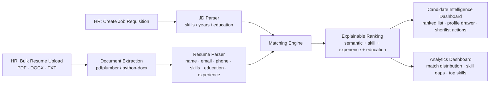

# TalentIQ — AI Resume Screener & Job Matcher

Smarter shortlisting through AI — from raw resume to ranked, explainable match.

An end-to-end, HR-facing Streamlit application built against the **AI Resume
Screener & Job Matcher** hackathon brief. It accepts bulk resumes (PDF / DOCX /
TXT), parses them into structured candidate profiles, matches them against a
job description with a transparent multi-factor score, and gives HR a ranked,
fully explainable shortlist — no black-box percentage, ever.


---

## 1. The problem

- **Manual screening doesn't scale.** Recruiters read hundreds of resumes per
  role by hand — slow and inconsistent.
- **Keyword-only search misses good candidates.** A resume that says "ML"
  instead of "Machine Learning" gets filtered out incorrectly.
- **Formatting chaos makes fair comparison hard.** Tables, columns, and
  scanned resumes are difficult to parse consistently.

**The goal:** parse resumes, understand skills semantically, and rank
candidates against a job description with a transparent, explainable score.

## 2. What TalentIQ does

| # | MVP feature | Status |
|---|---|---|
| 1 | Bulk resume upload (PDF / DOCX / TXT) | ✅ |
| 2 | Resume parsing — name, email, phone, LinkedIn, GitHub, portfolio/coding profile, skills, education, years of experience | ✅ |
| 3 | Job description input (paste or pick from saved requisitions) | ✅ |
| 4 | Skill extraction from the JD, with synonym/abbreviation matching | ✅ |
| 5 | Matching engine — weighted 0–100 relevance score per candidate | ✅ |
| 6 | Results dashboard — ranked list, matched/missing skills per candidate, and resume document viewer | ✅ |
| 7 | Multi-tenant cloud persistence & storage — Supabase PostgreSQL + private Storage bucket, with automatic offline fallback | ✅ |

Every page sits behind **sign-in / sign-up** (§2.5). Bonus features shipped: **Explainability** (full per-factor breakdown, not
just a score), **Bulk upload** (screen an entire batch into one ranked
shortlist), **Bias & fairness checking** (JD language scanner + a per-candidate
blind-scoring audit — see §2.1), **Interview question generation** (§2.2),
**Candidate email automation** (§2.3), and **Original resume viewer & downloader**.

### 2.1 Bias & fairness checking

Two independent, rule-based checks (no extra ML dependency):

- **JD language scanner** (Create Job Requisition page) — flags gender-coded,
  age-coded, ableist, and exclusionary wording as you type the job
  description, with a neutral rewrite suggested for every hit and an overall
  Low/Moderate/High risk badge.
- **Blind-scoring audit** (per candidate, in Candidate Intelligence, and
  summarized in Settings) — every score is *also* recomputed on a copy of the
  resume with name/email/phone redacted. The delta between the original and
  "blind" score is shown to the recruiter, turning the fairness claim into a
  number instead of a policy statement.

### 2.2 Interview question generator

From a candidate's profile, **Generate Interview Questions** builds a
structured guide (technical questions from their top matched skills, probing
questions for skill gaps, an experience question, and rotating behavioral
questions) from a curated question bank — no external LLM call, so it's
instant and works fully offline. Recruiters can edit, delete, and add questions
before downloading the guide as a `.txt` file.

### 2.3 Candidate email automation

From a candidate's profile, HR can select an email type (Selection/Offer,
Interview Invitation, or Rejection — the default follows the candidate's HR
status), edit the auto-filled subject/body, and either **send it directly**
via their own SMTP account (configured once in ⚙️ Settings — Gmail, Outlook,
Yahoo presets or a custom server; use an app password, not your login
password) or **download it as a `.eml` file** to open in their own mail
client if SMTP isn't set up. Credentials are never logged; see *What is saved*
below for how they are stored.

**What is saved.** The application provides multi-tenant cloud persistence
through **Supabase** with seamless offline fallback:

- *Requisitions & Candidates* → stored in Supabase PostgreSQL (`requisitions`,
  `candidates`, `interview_guides`, `email_logs`). Each record is tagged with
  the recruiter's authenticated `user_id` for complete multi-tenant isolation.
- *Resume Files* → uploaded directly to a private Supabase Storage bucket
  (`resumes`) under `{user_id}/{req_id}/{filename}` and can be viewed or
  downloaded directly within the candidate profile drawer.
- *Organization & Email Identity* (company name, your name, your title) →
  `data/settings.json` (git-ignored), saved per account.
- *Email Automation* (provider, host, port, email address, app password) →
  `~/.talentiq/smtp_<account id>.json` in the **user folder of the machine
  running the app, deliberately outside the project** so zipping, committing or
  submitting the project can't leak it.
  Saved with **Save email settings**; tick/untick *Remember on this computer*
  to keep it across restarts or for the current session only; **Forget email &
  password** deletes it. The saved password is never sent back to the browser.

The password is protected by file permissions (owner-only), **not encrypted**,
so always use an *app password* you can revoke, never your real login password.

**Public deployments:** each account has its own saved mailbox, so visitors
can't use each other's. The password is still plain text on the server's disk,
though; if you'd rather not keep it there at all, set the environment variable
`TALENTIQ_DISABLE_SAVED_SMTP=1` and credentials are never written to or read
from disk (session-only). Other overrides: `TALENTIQ_DATA_DIR`,
`TALENTIQ_SECRET_DIR`.

### 2.5 Accounts: sign in, sign up, sign out

Nothing in the workspace renders until a recruiter signs in.

- **Supabase Auth Integration** — accounts are authenticated against Supabase
  Auth (GoTrue) in production, meaning user accounts and data persist
  independently of container reboots or cloud redeployments.
- **7-Day Session Persistence** — signed-in recruiters receive a tamper-proof
  HMAC-signed session token stored in browser local storage, preventing
  accidental logout on page refreshes.
- **Offline Demo Fallback** — if Supabase credentials are not configured,
  TalentIQ gracefully runs in local demo mode, keeping the app 100% functional
  with zero external setup.
- **Create account** — full name, work email, password (8+ characters with a
  letter and a number; very common passwords are rejected). The name pre-fills
  the email sign-off in Settings.
- **Sign in** — email + password. Emails are case-insensitive. Wrong
  password and unknown email give the same message, and 5 wrong passwords in a
  row lock that account for 5 minutes.
- **Sign out** — sidebar button (or Settings → Account). Clears the session
  and token so the next user starts clean.
- **Per-account tenant isolation** — organization identity, workspace prefs,
  job requisitions, candidates, guides, and mailboxes are strictly isolated per
  account, ensuring recruiters on a shared deployment only access their own
  work.

### 2.4 Dashboard behaviour

- **Active Jobs can be zero.** Delete any requisition from *Resume Upload →
  Manage this requisition*, or from the *Remove a job requisition* panel on
  the Dashboard. The bundled demo requisition is only loaded once when a new
  session starts (and can be switched off in ⚙️ Settings → Session Data).
- **Time-aware greeting.** The dashboard says Good morning (05:00–11:59),
  Good afternoon (12:00–16:59) or Good evening (17:00–04:59), using the
  viewer's browser timezone when Streamlit provides it, otherwise the server
  clock.

## 3. How scoring works (the "why AI" answer)

A bare keyword match treats "ML" and "Machine Learning" as unrelated strings.
TalentIQ instead blends **semantic** similarity with **evidence-based**
signals, using the same weighting shown in the product's AI Pipeline panel:

| Factor | Weight | What it measures |
|---|---|---|
| Semantic Relevance | 50% | Similarity between the full resume and the JD text — TF-IDF cosine similarity by default, or meaning-based sentence-transformer embeddings if enabled (§3.1) — rescaled across the current applicant pool so scores reflect *relative* fit for this role |
| Skill Alignment | 30% | Share of the JD's required skills found on the resume, using a synonym-aware skill taxonomy (`ML` → `Machine Learning`, `JS` → `JavaScript`, etc.) |
| Experience Evidence | 15% | Candidate's detected years of experience vs. the role's minimum |
| Education Evidence | 5% | Candidate's detected education level vs. the role's requirement |

Every score comes with a **"Why This Match"** explanation, a matched-skills /
missing-skills breakdown, and a bar for each of the four factors above — so a
recruiter always knows *why* a candidate ranked where they did, and what to
probe for in a screening call.

**Fairness:** candidate name, gender-coded wording, and college tier are never
inputs to the scoring logic. TalentIQ produces decision-support signals; a
human recruiter makes the final call — and the blind-scoring audit in §2.1
verifies that claim on every single candidate, not just in the abstract.

### 3.1 Semantic matching engine

Semantic Relevance runs on TF-IDF cosine similarity by default — zero extra
install, instant. An optional sentence-transformer embeddings engine
(`all-MiniLM-L6-v2`) is available for meaning-based matching (catches
phrasing TF-IDF misses, e.g. "led a squad" vs. "managed a team"): install
`requirements.txt` and pick it in ⚙️ Settings → Semantic Matching
Engine. If the package isn't installed, every mode transparently falls back
to TF-IDF — nothing breaks. Each candidate's profile shows which engine
actually produced their score.

## 4. Architecture



### Project layout

```
talentiq/
├── app.py                         # Streamlit entrypoint (all pages & UI components)
├── Dockerfile                     # Container deployment image definition
├── docker-compose.yml             # Single-command Docker Compose orchestration
├── requirements.txt               # Dependencies (Streamlit, Scikit-learn, Supabase, etc.)
├── .env.example                   # Environment variable template
├── .streamlit/config.toml         # UI theme and server configuration
├── src/
│   ├── parser.py                  # Multi-format text extraction (PDF/DOCX/TXT) + structured parsing
│   ├── matcher.py                 # Weighted scoring engine + batch ranking + explainability
│   ├── bias_checker.py             # JD language scanner + blind-scoring fairness audit
│   ├── interview_questions.py      # Rule-based interview question generator
│   ├── email_automation.py         # Email templates + SMTP send + .eml export
│   ├── auth.py                     # Accounts: Supabase Auth (GoTrue) + 7-day HMAC session persistence
│   ├── auth_ui.py                  # Responsive sign-in / sign-up modal interface
│   ├── db.py                       # Cloud persistence & storage via Supabase (PostgreSQL + Storage)
│   ├── settings_store.py           # Saved org identity, workspace defaults, SMTP credentials (per account)
│   ├── skills_taxonomy.py          # Curated skill list + synonym/abbreviation map
│   ├── sample_data.py              # Bundled demo dataset loader
│   └── styling.py                   # Custom CSS / design system helpers
├── sample_data/
│   ├── resumes/                    # 8 sample candidate resumes (PDF, DOCX, TXT)
│   └── job_descriptions/          # 3 sample JDs (Machine Learning Engineer, Full Stack, DevOps)
├── supabase/
│   └── resume_storage.sql          # Complete Supabase schema (tables, indexes, private storage bucket)
├── scripts/
│   ├── tenant_isolation_migration.sql # Multi-tenant isolation & Row Level Security (RLS) policies
│   └── build_sample_data.py        # Dataset curation script
└── tests/
    ├── test_auth.py                # Unit tests for authentication & session tokens
    ├── test_candidate_mgmt.py      # Candidate management & deduplication tests
    ├── test_parser.py              # Parsing & portfolio link extraction tests
    ├── test_parser_regression.py   # Full parser regression test suite
    └── test_tenant_isolation.py    # Multi-tenant scoping & storage isolation tests
```

## 5. Running it locally

```bash
# 1. Clone repository and set up virtual environment
git clone https://github.com/anuvab2004/TalentIQ-Resume-Screener.git
cd TalentIQ-Resume-Screener
python3 -m venv .venv
source .venv/bin/activate        # Windows: .venv\Scripts\activate
pip install -r requirements.txt

# 2. Configure environment (Optional: enables Supabase cloud persistence; runs offline if omitted)
cp .env.example .env

# 3. Launch the Streamlit application
streamlit run app.py
```

Open the URL Streamlit prints (usually `http://localhost:8501`), choose
**Create account** (or **Sign in**), and you're in.

**Run the automated test suite:**
```bash
python -m unittest discover -s tests -v
```

**Try it instantly, with no uploads:** open **Resume Upload**, leave
"include the bundled sample candidates" checked, and click **Run AI
Screening**. A ready-made *Machine Learning Engineer* requisition and 8 demo
candidates across PDF, DOCX, and TXT formats are pre-loaded.

## 6. Deploying it

### Supabase Database & Storage Setup (Recommended)
To enable multi-tenant cloud persistence for requisitions, candidates, and uploaded resume files:
1. Create a free project at [supabase.com](https://supabase.com).
2. Go to **SQL Editor** and run `supabase/resume_storage.sql` to initialize the database tables (`requisitions`, `candidates`, `interview_guides`, `email_logs`) and private `resumes` storage bucket.
3. Run `scripts/tenant_isolation_migration.sql` to enable Row Level Security (RLS) and multi-tenant policies.
4. Copy your **Project URL** and **Anon/Publishable Key** from Project Settings → API into your `.env` or hosting provider secrets.

### Streamlit Community Cloud (fastest)
1. Push this repository to GitHub.
2. Go to [share.streamlit.io](https://share.streamlit.io) → **New app**.
3. Point it at your repo, branch (`main`), and `app.py`.
4. In **Advanced Settings** → **Secrets**, add your Supabase credentials:
   ```toml
   SUPABASE_URL = "https://your-project.supabase.co"
   SUPABASE_KEY = "your-anon-publishable-key"
   ```
5. Deploy — `requirements.txt` and `.streamlit/config.toml` are picked up
   automatically.

### Docker & Docker Compose (Recommended for Containerized Environments)

Run TalentIQ with a single command using Docker Compose:

```bash
# 1. Configure environment
cp .env.example .env

# 2. Start the container with Docker Compose
docker compose up -d --build

# 3. View running logs
docker compose logs -f

# 4. Stop the container
docker compose down
```

Open your browser at **http://localhost:8501**. User accounts, organization settings, and credentials will automatically persist in the `talentiq-data` Docker volume.

#### Using standalone Docker CLI:

```bash
# Build the Docker image
docker build -t talentiq:latest .

# Run container with volume persistence for user data
docker run -d -p 8501:8501 --env-file .env -v talentiq-data:/app/data --name talentiq-app talentiq:latest
```

#### Optional: Building with Sentence-Transformers Embeddings

To bundle the local embeddings model into the container image:

```bash
docker build --build-arg INSTALL_EMBEDDINGS=true -t talentiq:embeddings .
```

### Any other host (Render, Railway, an internal VM, etc.)
The app uses Supabase for authentication and database persistence (requisitions, candidates, guides, and logs):

```bash
pip install -r requirements.txt
streamlit run app.py --server.port $PORT --server.address 0.0.0.0
```

## 7. Using it end-to-end

1. **➕ Create Job Requisition** — enter a title/department, paste a JD (or
   start from a bundled sample), and TalentIQ auto-detects required skills,
   minimum years, and education level.
2. **📁 Resume Upload** — pick the requisition, drag in resumes in bulk (or
   use the sample candidates), and click **Run AI Screening**.
3. **🧠 Candidate Intelligence** — review the ranked list, filter by match
   tier, search by name/skill, open any candidate's full explainable profile,
   view/download their original resume document, and Shortlist / Move to Review / Reject.
   Export the ranked shortlist as CSV.
4. **🏠 Dashboard** — track Active Jobs, Resumes Screened, Skills Identified,
   and Candidates Shortlisted, plus match-distribution, top-skill, experience,
   and skill-gap charts across every requisition you've run.
5. **⚙️ Settings** — see the scoring weights, the fairness statement and
   blind-scoring audit summary, set your Organization & Email Identity,
   connect an SMTP account for candidate email automation (§2.3), and choose
   the semantic matching engine (§3.1). Reset session data here too.

From any candidate's profile (Candidate Intelligence → **View Profile**) you
can also: mark **Shortlisted / Review / Rejected**, **Generate Interview
Questions**, view the candidate's verified social & coding profiles (LinkedIn,
GitHub, LeetCode, HackerRank, Portfolio), download/preview their original resume file,
and send or download a **Selection / Interview / Rejection** email — see §2.1–2.3 for details.

## 8. Sample data

`sample_data/` ships 8 anonymized candidates across PDF, DOCX, and TXT formats
and 3 job descriptions (Machine Learning Engineer, Full Stack Developer, DevOps
Engineer) so anyone can demo the full multi-format parsing pipeline with zero setup.
The underlying resume/JD text originates from a public Kaggle resume-category
dataset and a public job-postings dataset; names, emails, and phone numbers
were synthesized for the demo and are fictional.

## 9. Known limitations / what's next

- Skill extraction uses a curated taxonomy + synonym map rather than a full
  NER model — broad coverage of tech, business, and soft skills, but an
  unusual or highly niche skill may go undetected. Swapping in a
  `sentence-transformers` embedding model or a spaCy NER pipeline is a
  natural upgrade path.
- Years-of-experience detection uses explicit phrases ("5+ years of
  experience") and date-range heuristics; a resume with neither will show
  "0 years" until reviewed manually.
- Cloud persistence is powered by Supabase PostgreSQL and private Storage with
  Row Level Security; upcoming enhancements include direct webhook integrations
  with external ATS platforms (e.g. Greenhouse, Lever, Workday).
- The JD bias scanner and interview-question generator are rule-based/curated
  rather than model-generated, in the same dependency-light spirit as the
  default TF-IDF matching engine; an LLM-backed rewrite is a natural upgrade
  path for both, similar to the optional embeddings engine in §3.1.
- Email sending requires the recruiter's own SMTP credentials (no email
  provider is bundled); without them, emails can still be drafted and
  downloaded as `.eml` files.

---

*TalentIQ provides decision-support signals and does not replace human
hiring judgment.*
